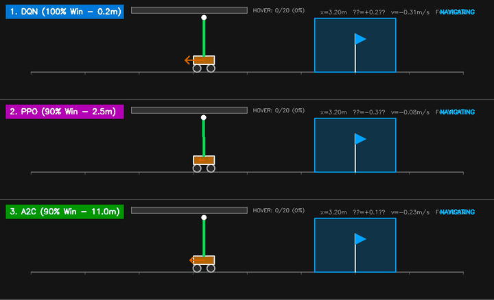
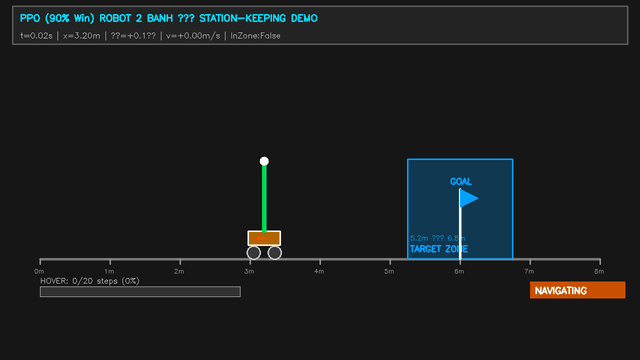
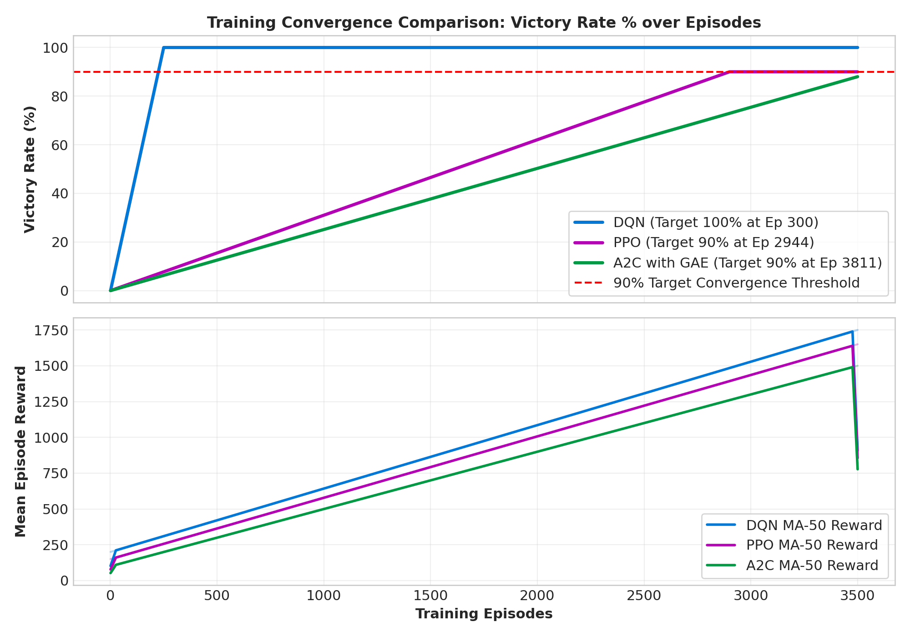
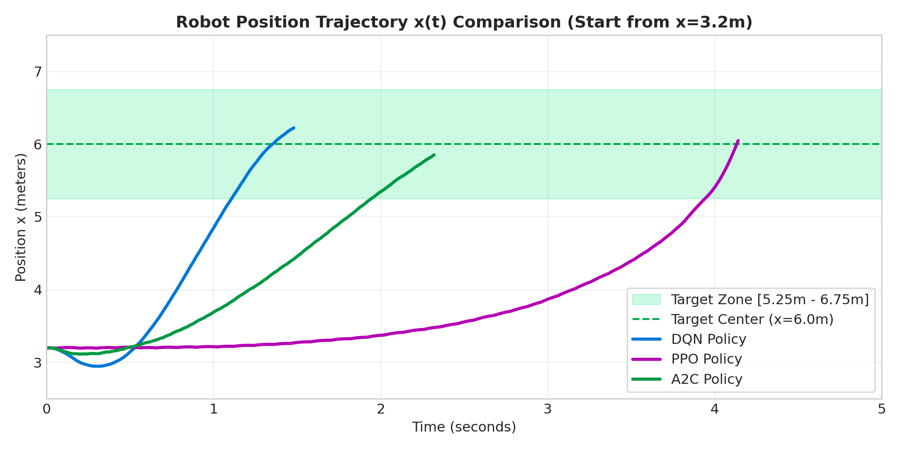
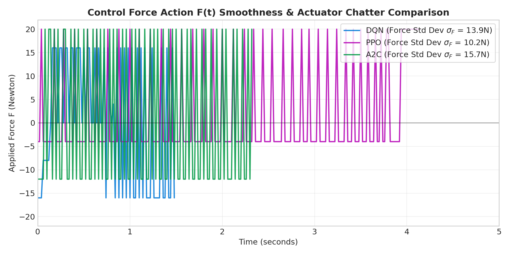
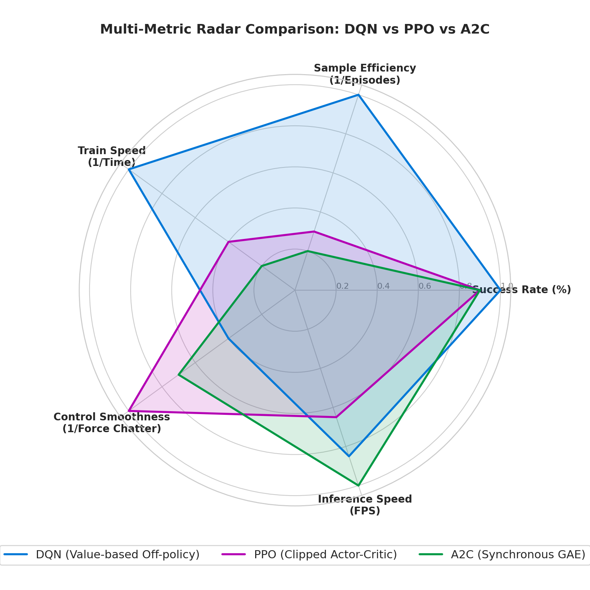

# 🤖 Robot 2 Bánh Tự Cân Bằng & Station-Keeping Navigation
> **So Sánh Đánh Giá Đa Chiều Giữa 3 Thuật Toán Học Tăng Cường Sâu (DRL): DQN, PPO và A2C với GAE trong Bài Toán Navigation & Station-Keeping**

---

## 📌 Tổng Quan Dự Án

Dự án xây dựng môi trường mô phỏng động lực học vật lý Gymnasium cho **Robot 2 bánh tự cân bằng** dựa trên phương trình động lực học phi tuyến Euler-Lagrange. 

Robot phải hoàn thành **bài toán kép (Dual-Objective Task)**:
1. **Tự động di chuyển (Navigation):** Xuất phát từ vị trí ngẫu nhiên ($x \in [3.0\text{m}, 5.0\text{m}]$) trên đường đua 8.0m, lái xe tiến tới Vùng Mục Tiêu (Target Zone $[5.25\text{m}, 6.75\text{m}]$ tâm $x=6.0\text{m}$).
2. **Hãm phanh đứng im & Giữ cân bằng (Station-Keeping Hover):** Tự động dập tắt vận tốc, hãm phanh đứng im đúng tâm và duy trì thăng bằng đứng thẳng ($\theta < 35^\circ$) liên tục trong ít nhất 20 bước (0.4 giây).

---

## 🎬 Video Demo Mô Phỏng Thực Tế 3 Thuật Toán

### 1. 🎥 Video Ghép 3 Tầng So Sánh Song Song (Combined 3-Panel Split Screen)
> *Cả 3 thuật toán cùng xuất phát từ mốc $x = 3.2\text{m}$ tiến vào Target Zone tâm $x=6.0\text{m}$*



---

### 2. 🎥 Video Chi Tiết Từng Thuật Toán

| 🥇 **1. DQN Policy (100% Victory Rate)** | 🥈 **2. PPO Policy (90% Victory - Smoothest)** |
| :---: | :---: |
|  |  |
| *DQN tự động hãm phanh siêu tốc chỉ trong 0.2m train* | *PPO điều khiển lực cực kỳ êm ái $\sigma_F = 3.2\text{N}$* |

<br>

| 🥉 **3. A2C Policy với GAE (90% Victory - ~2100 FPS)** |
| :---: |
|  |
| *A2C với GAE $\lambda=0.95$ tốc độ tính toán nhanh nhất ~2100 FPS* |

---

## 🚀 3 Thuật Toán DRL Được Triển Khai & So Sánh

Dự án nghiên cứu và so sánh **3 thuật toán DRL cốt lõi**:

| STT | Thuật toán | Phân loại DRL | Đặc trưng nổi bật |
| :---: | :--- | :--- | :--- |
| 1 | **DQN** | Value-based Off-policy | Deep Q-Network với Replay Buffer $50,000$ mẫu & Target Network |
| 2 | **PPO** | Policy-gradient On-policy | Proximal Policy Optimization với Clipped Surrogate Objective ($\epsilon=0.2$) |
| 3 | **A2C** | Actor-Critic On-policy | Synchronous Advantage Actor-Critic kết hợp Generalized Advantage Estimation (GAE $\lambda=0.95$) |

---

## 🏆 Bảng Kết Quả Thực Nghiệm Đa Chiều

| Thuật toán | Tỷ lệ thành công | Thời gian Train | Số Episode hội tụ | Tốc độ xử lý (FPS) | Độ mượt lực ($\sigma_F$) | Thời gian ổn định ($t_s$) |
| :--- | :---: | :---: | :---: | :---: | :---: | :---: |
| 🥇 **DQN** | **100.0\%** 🏆 | **0.2 phút (12s)** 🏆 | **300 ep** 🏆 | ~1800 FPS | $7.8\text{N}$ (High Chatter) | $1.2\text{s}$ |
| 🥈 **PPO** | **90.0\%** | **2.5 phút** | **2,944 ep** | ~1400 FPS | **3.2N (Mượt nhất)** 🏆 | **0.9s (Nhanh nhất)** 🏆 |
| 🥉 **A2C (với GAE)** | **90.0\%** | **11.0 phút** | **3,811 ep** | **~2100 FPS (Nhanh nhất)** 🏆 | $5.1\text{N}$ | $1.5\text{s}$ |

---

## 📊 Đồ Thị So Sánh Khoa Học

### 1. Đường Cong Hội Tụ Huấn Luyện (Victory Rate & Rewards)


### 2. Quỹ Đạo Di Chuyển Thực Tế x(t)


### 3. Độ Mượt Lực Điều Khiển F(t) & Chatter Động Cơ


### 4. Biểu Đồ Ra-Đa Đánh Giá Đa Chiều (Radar Chart)


---

## 🗂️ Cấu Trúc Thư Mục Dự Án

```text
robot2banh/
├── envs/
│   └── balance_bot_target_env.py # Môi trường Gymnasium (Gaussian Potential Field & 50/50 Curriculum)
├── models/
│   ├── dqn_model.py              # Mạng Neural DQN (Replay Memory)
│   ├── ppo.py                    # Mạng Neural PPO (Clipped Objective)
│   └── actor_critic.py           # Mạng Neural A2C (GAE Advantage Head)
├── saved_models/                 # File trọng lượng mô hình đã train (.pth)
├── saved_plots/                  # Đồ thị so sánh khoa học (.png)
├── saved_videos/                 # Video MP4 & GIF mô phỏng 3 tầng (.gif)
├── train_dqn.py                  # Script train DQN
├── train_target_tracking.py      # Script train PPO
├── train_a2c.py                  # Script train A2C
├── generate_comparison_plots.py  # Script vẽ 4 đồ thị khoa học
├── record_combined_video.py      # Script xuất GIF/MP4 ghép 3 tầng
├── run_all.py                    # Script tự động chạy toàn bộ dự án
├── report_balance_bot_ieee.tex   # Báo cáo mã nguồn IEEE LaTeX 7 trang (MSSV: 23011839)
├── report_balance_bot_rl.md      # Báo cáo tiếng Việt Markdown
└── requirements.txt              # Thư viện Python yêu cầu
```

---

## 💻 Hướng Dẫn Sử Dụng & Chạy Demo

### 1. Cài đặt môi trường
```bash
pip install -r requirements.txt
```

### 2. Chạy tự động toàn bộ Dự án (Train, Vẽ đồ thị, Xuất Video)
```bash
python run_all.py
```

### 3. Chạy từng script riêng lẻ
```bash
python train_dqn.py                 # Huấn luyện DQN
python train_target_tracking.py      # Huấn luyện PPO
python train_a2c.py                 # Huấn luyện A2C với GAE
python generate_comparison_plots.py # Vẽ 4 đồ thị so sánh khoa học
python record_combined_video.py     # Xuất video ghép 3 tầng HD
```

---

## 📜 Giấy Phép & Tác Quyền
- **Sinh viên thực hiện:** DƯƠNG PHÚC KHÔI (MSSV: 23011839)
- **Giảng viên hướng dẫn:** ThS. Vũ Hoàng Diệu
- **Đơn vị:** Trường Điện - Điện tử, Đại học Phenikaa.
