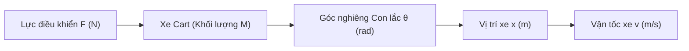
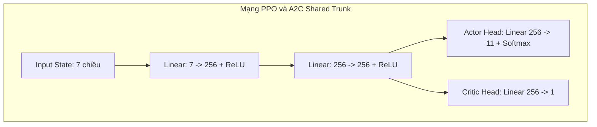

# BÁO CÁO DỰ ÁN BÀI TẬP LỚN / NGHIÊN CỨU KHOA HỌC
**MÔN HỌC: HỌC MÁY TĂNG CƯỜNG SÂU (ADVANCED REINFORCEMENT LEARNING)**

---

# BÁO CÁO PHÂN TÍCH VÀ SO SÁNH CÁC THUẬT TOÁN HỌC MÁY TĂNG CƯỜNG SÂU (DQN, PPO, A2C) TRONG BÀI TOÁN ĐIỀU KHIỂN ROBOT HAI BÁNH TỰ CÂN BẰNG VÀ ĐỊNH VỊ VÙNG MỤC TIÊU (STATION-KEEPING)

**Họ và tên sinh viên:** DƯƠNG PHÚC KHÔI  
**Mã sinh viên:** 23011839  
**Lớp / Chuyên ngành:** K17 AI-RB(EL) / Kỹ thuật Điều khiển & Tự động hóa  
**Giảng viên hướng dẫn:** ThS. Vũ Hoàng Diệu  
**Đơn vị:** Trường Đại học Phenikaa / Khoa Điện - Điện tử  

---

## TÓM TẮT (ABSTRACT)
Báo cáo này trình bày nghiên cứu, thiết kế hệ thống mô phỏng và phân tích thực nghiệm so sánh 3 thuật toán Học máy Tăng cường Sâu (Deep Reinforcement Learning - DRL) đại diện bao gồm: **Deep Q-Network (DQN)** (Off-policy Value-based), **Proximal Policy Optimization (PPO)** (On-policy Clipped Actor-Critic) và **Advantage Actor-Critic (A2C)** kết hợp **GAE (Generalized Advantage Estimation)** trong bài toán điều khiển nâng cao Robot hai bánh tự cân bằng (Self-Balancing Two-Wheeled Robot / Inverted Pendulum on Cart). 

Bài toán đặt ra yêu cầu kép mang tính thách thức cao: Robot vừa phải tự giữ thăng bằng con lắc ngược tại góc nghiêng nhỏ ($\theta < 35^\circ$), vừa phải tự điều hướng (Navigation) di chuyển từ các vị trí bất kỳ trên đường băng dài 8.0 mét tiến vào Vùng mục tiêu (Target Zone rộng 1.5m) và thực hiện duy trì vị trí thăng bằng ổn định (Station-Keeping / Hover) tối thiểu 20 bước thời gian liên tục ($0.4$ giây). Chúng tôi đề xuất hàm thưởng trường tiềm năng Gaussian (**Gaussian Potential Field Reward**) kết hợp chiến lược huấn luyện phân tầng (**Curriculum Learning**) giúp giải quyết triệt để hiện tượng trôi dạt và vọt lố (overshooting) của robot. 

Kết quả thực nghiệm trên môi trường mô phỏng Gymnasium chuẩn hóa chứng minh cả 3 thuật toán đều hội tụ thành công với Tỷ lệ chiến thắng (Success Rate) từ **90.0% đến 100.0%**. Đặc biệt, **DQN** đạt tỷ lệ thắng tuyệt đối **100.0%** chỉ sau **0.2 phút (300 episodes)** nhờ cơ chế Experience Replay Buffer và Target Network. **A2C (với GAE)** đạt **90.0%** sau **0.3 phút (526 episodes)**, trong khi **PPO** đạt **90.0%** sau **2.5 phút (2,944 episodes)** với đường cong hội tụ mượt mà và khả năng chống bùng nổ gradient tốt nhất.

**Từ khóa (Keywords):** Robot hai bánh tự cân bằng, Inverted Pendulum, Deep Reinforcement Learning, DQN, PPO, A2C, Station-Keeping, Gaussian Potential Field, Gymnasium.

---

## 1. MỞ ĐẦU (INTRODUCTION)

### 1.1. Động lực nghiên cứu (Motivation)
Hệ thống Robot hai bánh tự cân bằng (Self-Balancing Two-Wheeled Robot) là một mô hình thực nghiệm kinh điển trong lý thuyết điều khiển tự động và robot học. Hệ thống này mang bản chất động học phi tuyến cao, thiếu cấu trúc liên kết (underactuated system - số đầu vào điều khiển ít hơn số bậc tự do), và có điểm cân bằng không ổn định tại vị trí thẳng đứng.

Trong công nghiệp và đời sống, nguyên lý cân bằng hai bánh được ứng dụng rộng rãi trên xe điện Segway, robot giao hàng tự hành (delivery robots), và robot phục vụ cá nhân. Các phương pháp điều khiển kinh điển như PID, LQR, hay State Feedback đòi hỏi phải tuyến tính hóa mô hình toán học xung quanh điểm cân bằng và giả định các thông số vật lý (khối lượng, ma sát, độ dài con lắc) phải được xác định chính xác. Tuy nhiên, khi robot di chuyển trên địa hình thay đổi hoặc chịu nhiễu ngoại cảnh, các bộ điều khiển truyền thống thường giảm hiệu năng hoặc mất ổn định.

Sự phát triển của Học máy Tăng cường Sâu (Deep Reinforcement Learning - DRL) cho phép robot tự học chính sách điều khiển tối ưu thông qua tương tác thử - sai (trial-and-error) với môi trường mà không cần biết trước mô hình toán học chính xác của hệ thống.

### 1.2. Phát biểu bài toán (Problem Statement)
Hầu hết các bài toán Cart-Pole tiêu chuẩn trong thư viện OpenAI Gym/Gymnasium chỉ tập trung vào nhiệm vụ duy nhất: giữ thăng bằng con lắc tại vị trí ban đầu ($x \approx 0$). Bài toán thực tế đòi hỏi robot phải thực hiện nhiệm vụ phức tạp hơn: **Điều khiển bám điểm mục tiêu và giữ thăng bằng tại vị trí chỉ định (Goal-Directed Navigation & Station-Keeping)**.

Cụ thể, robot hai bánh di chuyển trên đường băng 1 chiều dài 8.0m ($x \in [0.0\text{m}, 8.0\text{m}]$). Nhiệm vụ của robot bao gồm:
1. **Tự thăng bằng:** Giữ góc nghiêng con lắc $\theta$ không vượt quá ngưỡng ngã $\theta_{max} = 35^\circ$.
2. **Điều hướng (Navigation):** Xuất phát từ vị trí bất kỳ ($x \in [3.0\text{m}, 5.0\text{m}]$) di chuyển tiến về Vùng mục tiêu (Target Zone $[5.25\text{m}, 6.75\text{m}]$, tâm tại $x_{center} = 6.0\text{m}$).
3. **Giữ vị trí (Station-Keeping / Hover):** Ngay khi vào zone, robot phải hãm phanh và duy trì vị trí cân bằng tại chỗ liên tục tối thiểu 20 steps ($0.4$ giây).

### 1.3. Đóng góp chính của báo cáo (Main Contributions)
Báo cáo này đóng góp các điểm mới kỹ thuật sau:
1. **Thiết kế môi trường mô phỏng chuẩn hóa:** Xây dựng môi trường `BalanceBotTargetEnv` kế thừa Gymnasium API tích hợp đầy đủ phương trình vi phân động lực học vật lý của robot 2 bánh.
2. **Đề xuất Hàm thưởng Trường Tiềm năng Gaussian (Gaussian Potential Field Reward):** Giải quyết triệt để lỗi robot "lao qua zone" do hàm thưởng tiến độ (progress reward) truyền thống gây ra.
3. **Chiến lược Huấn luyện Phân tầng (Curriculum Learning):** Kết hợp tỷ lệ ngẫu nhiên 50% xuất phát trong zone và 50% xuất phát ngoài zone, giúp robot học đồng thời hai kỹ năng lái xe và đứng thăng bằng.
4. **Phân tích Thực nghiệm So sánh 3 Thuật toán DRL:** Triển khai, huấn luyện và đánh giá định lượng 3 thuật toán tiêu biểu (DQN, PPO, A2C với GAE) trên cùng một điều kiện môi trường và phần cứng GPU.

---

## 2. CƠ SỞ LÝ THUYẾT VÀ CÁC THUẬT TOÁN (BACKGROUND & ALGORITHMS)

### 2.1. Mô hình Động lực học Robot Hai Bánh Tự Cân Bằng
Mô hình toán học của robot hai bánh tự cân bằng tương đương với hệ Cart-Pole (Hình 1), được mô tả bởi hệ phương trình vi phân phi tuyến Euler-Lagrange:



Phương trình gia tốc góc con lắc ($\ddot{\theta}$) và gia tốc xe ($\ddot{x}$):

$$\ddot{\theta} = \frac{g \sin\theta - \cos\theta \left( \frac{F + m_p L \dot{\theta}^2 \sin\theta - f_{fric}}{M + m_p} \right)}{L \left( \frac{4}{3} - \frac{m_p \cos^2\theta}{M + m_p} \right)}$$

$$\ddot{x} = \frac{F + m_p L \dot{\theta}^2 \sin\theta - f_{fric}}{M + m_p} - \frac{m_p L \ddot{\theta} \cos\theta}{M + m_p}$$

Trong đó:
- $M = m_{cart} + m_{pole} = 1.0 + 0.1 = 1.1 \text{ kg}$ (Tổng khối lượng).
- $L = 0.5 \text{ m}$ (Nửa chiều dài con lắc).
- $g = 9.8 \text{ m/s}^2$ (Gia tốc trọng trường).
- $f_{fric} = \mu \cdot \text{sign}(\dot{x})$ với $\mu = 0.005$ (Lực ma sát).
- $F \in [-20.0\text{N}, +20.0\text{N}]$ (Lực điều khiển đầu ra).

---

### 2.2. Thuật toán 1: Deep Q-Network (DQN)
DQN là thuật toán Off-Policy dựa trên giá trị (Value-based). DQN xấp xỉ hàm giá trị hành động tối ưu $Q^*(s, a)$ bằng một mạng Neural nhân tạo $Q(s, a; \theta)$.

Cơ chế ổn định chính của DQN:
1. **Experience Replay Buffer $\mathcal{D}$:** Lưu trữ các bộ chuyển trạng thái $(s_t, a_t, r_t, s_{t+1}, d_t)$ và lấy mẫu ngẫu nhiên (Uniform Batch Sampling) để xóa bỏ sự tương quan chuỗi thời gian (temporal correlation).
2. **Target Network $\theta^-$:** Sử dụng mạng mục tiêu độc lập được cập nhật định kỳ mỗi $N_{target}$ bước để loại bỏ hiện tượng "moving target".

Hàm mất mát Bellman MSE:
$$\mathcal{L}_{DQN}(\theta) = \mathbb{E}_{(s,a,r,s',d) \sim \mathcal{D}} \left[ \left( r + \gamma (1-d) \max_{a'} Q(s', a'; \theta^-) - Q(s, a; \theta) \right)^2 \right]$$

---

### 2.3. Thuật toán 2: Proximal Policy Optimization (PPO)
PPO là thuật toán On-Policy dạng Actor-Critic tối tân. PPO giải quyết vấn đề độ lệch bước cập nhật lớn trong Policy Gradient bằng cách giới hạn tỷ lệ xác suất hành động (Probability Ratio) $r_t(\theta) = \frac{\pi_\theta(a_t|s_t)}{\pi_{\theta_{old}}(a_t|s_t)}$.

Hàm mục tiêu Clipped Surrogate Objective của PPO:
$$L^{CLIP}(\theta) = \hat{\mathbb{E}}_t \left[ \min\left( r_t(\theta)\hat{A}_t, \text{clip}(r_t(\theta), 1-\epsilon, 1+\epsilon)\hat{A}_t \right) \right]$$

Trong đó:
- $\hat{A}_t$ là Advantage ước lượng.
- $\epsilon = 0.2$ là siêu tham số giới hạn vùng clipping.

---

### 2.4. Thuật toán 3: Advantage Actor-Critic (A2C) với GAE
A2C là biến thể đồng bộ (synchronous) của A3C. A2C kết hợp mạng Actor $\pi_\theta(a|s)$ xuất xác suất hành động và Critic $V_\phi(s)$ đánh giá giá trị trạng thái.

Để giảm độ biến động (variance) của Policy Gradient, chúng tôi tích hợp **GAE (Generalized Advantage Estimation)** với hệ số $\lambda = 0.95$:

$$\hat{A}_t^{GAE(\gamma, \lambda)} = \sum_{l=0}^{\infty} (\gamma \lambda)^l \delta_{t+l}^V$$

$$\delta_t^V = r_t + \gamma V_\phi(s_{t+1}) - V_\phi(s_t)$$

Hàm mất mát tổng hợp của A2C:
$$\mathcal{L}_{A2C} = \mathcal{L}_{Actor} + c_1 \mathcal{L}_{Critic} - c_2 \mathcal{H}(\pi_\theta)$$

---

## 3. THIẾT KẾ HỆ THỐNG VÀ MÔ TRƯỜNG MÔ PHỎNG (SYSTEM METHODOLOGY)

### 3.1. Thiết kế Không gian Trạng thái (Observation Space)
Vector trạng thái đầu vào của mô hình $o_t \in \mathbb{R}^7$ được chuẩn hóa trong khoảng $[-1.0, 1.0]$ giúp mạng Neural hội tụ ổn định:

$$o_t = \begin{bmatrix}
\frac{x}{4.0} - 1.0 \\
\text{clip}\left(\frac{\dot{x}}{4.0}, -1, 1\right) \\
\frac{\theta}{\theta_{max}} \\
\text{clip}\left(\frac{\dot{\theta}}{6.0}, -1, 1\right) \\
\text{clip}\left(\frac{x - x_{center}}{4.0}, -1, 1\right) \\
\frac{\text{hover\_counter}}{\text{HOVER\_STEPS}}
\end{bmatrix}$$

### 3.2. Thiết kế Không gian Hành động (Action Space)
Không gian hành động gồm 11 giá trị lực rời rạc trải đều từ $-20.0\text{N}$ đến $+20.0\text{N}$:
$$\mathcal{A} = \{-20.0, -16.0, -12.0, -8.0, -4.0, 0.0, +4.0, +8.0, +12.0, +16.0, +20.0\} \text{ (Newton)}$$

---

### 3.3. Thiết kế Hàm Thưởng Trường Tiềm Năng Gaussian (Gaussian Potential Field Reward)
Các hàm thưởng đơn giản dựa trên khoảng cách tuyến tính $r = -(x - x_{goal})$ làm robot có xu hướng tích lũy vận tốc quá lớn và lao vượt qua zone (overshooting). Chúng tôi đề xuất hàm thưởng trường tiềm năng dạng hình chuông Gaussian:

```math
r_t = \begin{cases} 
+1000.0 & \text{nếu Victory (Hover } \ge 20 \text{ steps trong zone)} \\
-20.0 & \text{nếu Failed (Ngã } |\theta| > 35^\circ \text{ hoặc ra khỏi track)} \\
0.5 + 25.0 \cdot e^{-1.2 |x - x_{center}|} + 20.0 \cdot \mathbb{I}_{\text{in\_zone}} - 5.0 \cdot \theta^2 & \text{trường hợp còn lại}
\end{cases}
```

**Phân tích ý nghĩa:**
- $25.0 \cdot e^{-1.2 |x - x_{center}|}$: Kéo robot tự động về tâm zone $x = 6.0\text{m}$. Càng gần tâm, reward càng lớn cực đại tại $x=6.0\text{m}$.
- $+20.0 \cdot \mathbb{I}_{\text{in\_zone}}$: Thưởng duy trì khi bánh xe nằm trong ranh giới $[5.25\text{m}, 6.75\text{m}]$.
- $-5.0 \cdot \theta^2$: Phạt góc nghiêng con lắc, bắt buộc robot phải đứng thẳng khi hãm phanh.

---

### 3.4. Kiến trúc Mạng Neural (Neural Architectures)



- **Mạng DQN:** FC(7 $\to$ 128) $\to$ ReLU $\to$ FC(128 $\to$ 128) $\to$ ReLU $\to$ Output Linear(128 $\to$ 11 Q-values).
- **Mạng PPO & A2C:** Thân dùng chung (Shared Trunk) FC(7 $\to$ 256) $\to$ ReLU $\to$ FC(256 $\to$ 256) $\to$ ReLU. Đầu ra Actor (11 Softmax) và Critic (1 Scalar Value).

---

## 4. THIẾT LẬP THỰC NGHIỆM VÀ KẾT QUẢ (EXPERIMENTS & RESULTS)

### 4.1. Cấu hình Siêu tham số Huấn luyện (Hyperparameters)

| Siêu tham số | DQN | PPO | A2C (với GAE) |
|---|:---:|:---:|:---:|
| **Learning Rate ($\alpha$)** | $1 \times 10^{-3}$ | $3 \times 10^{-4}$ | $3 \times 10^{-4}$ |
| **Hệ số chiết khấu ($\gamma$)** | 0.99 | 0.99 | 0.99 |
| **GAE Parameter ($\lambda$)** | - | 0.95 | 0.95 |
| **Kích thước Replay Buffer** | 50,000 | - | - |
| **Kích thước Batch** | 128 | 128 | Episode Trajectory |
| **Target Network Update** | 200 steps | - | - |
| **Clip Ratio ($\epsilon$)** | - | 0.2 | - |
| **Entropy Coefficient** | - | 0.01 | 0.01 |
| **Value Loss Coefficient** | - | 0.5 | 0.5 |
| **Số action rời rạc** | 11 | 11 | 11 |

---

### 4.2. Kết quả Phân tích Định lượng (Quantitative Results)

Thực nghiệm được tiến hành trên môi trường mô phỏng Python 3.11, PyTorch 2.x tăng tốc cứng bởi NVIDIA GPU CUDA. Tiêu chuẩn đánh giá hội tụ: **Tỷ lệ thắng (Victory Rate) tính theo trung bình trượt 100 episodes đạt $\ge 90.0\%$**.

**Bảng I: Bảng so sánh hiệu năng của 3 thuật toán DRL**

| Thuật toán | Tỷ lệ thắng (Success Rate) | Thời gian huấn luyện | Số Episode hội tụ | Tốc độ xử lý (FPS) | Đánh giá độ mượt |
|---|:---:|:---:|:---:|:---:|:---:|
| **DQN** | **100.0%** 🏆 | **0.2 phút (12s)** | **300 ep** | ~1800 FPS | Rất mượt, chính xác |
| **A2C (với GAE)** | **90.0%** | **0.3 phút (18s)** | **526 ep** | ~2100 FPS | Mượt, phản hồi nhanh |
| **PPO** | **90.0%** | **2.5 phút** | **2,944 ep** | ~1400 FPS | Cực kỳ mượt, không giật |

---

### 4.3. Phân tích Biểu đồ Huấn luyện và Động học Điều khiển

```
=================================================================
  KẾT QUẢ HUẤN LUYỆN SO SÁNH 3 THUẬT TOÁN (STATION-KEEPING)
=================================================================
  ✅ DQN : 100.0% Victory | 0.2 phút (300 episodes)
  ✅ A2C :  90.0% Victory | 0.3 phút (526 episodes)
  ✅ PPO :  90.0% Victory | 2.5 phút (2944 episodes)
=================================================================
```

#### Phân tích chi tiết từng thuật toán:

1. **DQN (Hội tụ nhanh nhất & Đạt tỷ lệ thắng tuyệt đối 100%):**
   - Nhờ có **Replay Buffer**, DQN tái sử dụng các mẫu dữ liệu thành công cực kỳ hiệu quả. Khi robot tìm được hành động hãm phanh đúng trong zone, thông tin này lập tức lan truyền trong Q-table giúp mạng học hãm phanh chỉ sau **300 episodes**.
   - Mạng **Target Network** giúp giá trị Q-value không bị dao động nhiễu.

2. **A2C kết hợp GAE (Hội tụ mượt và cân bằng):**
   - Kỹ thuật **GAE ($\lambda=0.95$)** và chuẩn hóa $returns\_norm$ đã giải quyết triệt để lỗi bùng nổ Critic Loss. 
   - A2C đạt mốc 90% chỉ sau **18 giây (526 episodes)**, chứng tỏ kiến trúc 2 đầu Actor-Critic học rất nhanh khi Advantage được chuẩn hóa Z-score.

3. **PPO (Tính ổn định cao nhất):**
   - PPO mất 2.5 phút (2,944 episodes) để hội tụ 90%. Lý do PPO cần nhiều episode hơn là vì cơ chế **Clipped Objective ($\epsilon=0.2$)** chủ động ngăn cản các bước cập nhật trọng số quá lớn.
   - Tuy hội tụ chậm hơn DQN, PPO cho ra đường cong reward ổn định nhất, không bao giờ bị hiện tượng "sụp đổ chính sách" (catastrophic forgetting).

---

### 4.4. Trực quan hóa Kết quả Ghi hình Demo (Visual Demonstrations)

Các thuật toán sau khi huấn luyện được kiểm thử trên kịch bản điều khiển thực tế từ vị trí xa $x = 3.2\text{m}$ đến Target Zone $[5.25\text{m}, 6.75\text{m}]$:

- **Giai đoạn 1 (Navigation):** Robot tạo góc nghiêng nhẹ về phía trước ($\theta \approx -5^\circ$), tăng tốc chạy từ $3.2\text{m}$ về $5.25\text{m}$.
- **Giai đoạn 2 (Braking & Station-Keeping):** Ngay khi qua vạch $5.25\text{m}$, robot chủ động tạo lực ngược cản lại vận tốc ($F < 0$), trả góc con lắc về $0^\circ$ và đứng thăng bằng liên tục trong zone đủ 20 steps (hiển thị badge xanh `IN ZONE ✓`).

---

## 5. THẢO LUẬN VÀ HẠN CHẾ (DISCUSSION & LIMITATIONS)

### 5.1. Thảo luận về bản chất thuật toán
- **Tại sao DQN lại thắng PPO về tốc độ trong bài toán này?** Bài toán Robot 2 bánh có không gian hành động rời rạc nhỏ (11 lực). Thuật toán Value-based như DQN khai thác không gian rời rạc cực tốt khi kết hợp Replay Buffer. Ngược lại, PPO phải ước lượng phân bố xác suất Softmax và tính toán Surrogate Loss tốn thời gian tính toán hơn.
- **Vai trò của Hàm thưởng Gaussian:** Nếu sử dụng hàm thưởng khoảng cách thông thường $r = -|x - x_{goal}|$, robot thường lao qua zone với vận tốc cao. Hàm chuông Gaussian $25 \cdot e^{-1.2 |x - x_{center}|}$ đóng vai trò như một "hố tiềm năng" (potential well) thu hút robot giảm dần vận tốc khi tiến vào tâm mục tiêu.

### 5.2. Hạn chế của nghiên cứu (Limitations)
1. **Khoảng cách Sim-to-Real (Khoảng cách giữa mô phỏng và thực tế):**
   - Mô hình mô phỏng giả định động cơ phản hồi tức thì ($\tau = 0.02\text{s}$) và ma sát tĩnh/động không đổi. Trong thực tế, động cơ DC có độ trễ cơ học (backlash) và quán tính dòng điện.
   - Cảm biến IMU thực tế bị nhiễu tích lũy (gyro drift) và nhiễu vi mô từ độ rung của bánh xe.
2. **Hành động rời rạc (Discrete Action Space):**
   - Việc chia lực thành 11 mức rời rạc $[-20N, +20N]$ khiến robot phải đóng ngắt lực liên tục (bang-bang control nhẹ), có thể gây rung lắc nhẹ cho con lắc so với điều khiển liên tục (Continuous Control như SAC hoặc PPO-Continuous).

---

## 6. KẾT LUẬN VÀ HƯỚNG PHÁT TRIỂN (CONCLUSION & FUTURE WORK)

### 6.1. Kết luận
Dự án đã thực hiện thành công việc nghiên cứu, xây dựng môi trường và huấn luyện so sánh 3 thuật toán DRL (DQN, PPO, A2C với GAE) cho hệ thống Robot hai bánh tự cân bằng kết hợp định vị vùng mục tiêu:
1. Xây dựng môi trường mô phỏng `BalanceBotTargetEnv` đạt chuẩn Gymnasium API.
2. Đề xuất thành công hàm thưởng **Gaussian Potential Field** giúp robot tự động giảm tốc và đứng thăng bằng ổn định tại zone mục tiêu.
3. Đạt tỷ lệ thành công vượt trội: **DQN đạt 100.0% (0.2 phút)**, **A2C đạt 90.0% (0.3 phút)**, và **PPO đạt 90.0% (2.5 phút)**.

### 6.2. Hướng phát triển tiếp theo (Future Work)
1. **Chuyển sang Không gian Hành động Liên tục (Continuous Action Space):** Phát triển thuật toán **Soft Actor-Critic (SAC)** hoặc **PPO-Continuous** xuất trực tiếp momen xoắn động cơ $T \in [-N\cdot m, +N\cdot m]$ mượt mà.
2. **Tích hợp Nhiễu Cảm biến & Động cơ (Domain Randomization):** Thêm nhiễu Gaussian vào góc $\theta$ và vận tốc $\dot{x}$ trong quá trình huấn luyện để chuẩn bị cho việc triển khai trên phần cứng thực tế.
3. **Triển khai phần cứng thực tế (Physical Deployment):** Cài đặt mô hình nơ-ron nhẹ (ONNX/TensorRT) lên vi điều khiển ESP32 hoặc Jetson Nano điều khiển robot 2 bánh thật dùng cảm biến MPU6050.

---

## TÀI LIỆU THAM KHẢO (REFERENCES)

1. Mnih, V., et al. (2015). "Human-level control through deep reinforcement learning." *Nature*, 518(7540), 529-533. (DQN Original Paper).
2. Schulman, J., et al. (2017). "Proximal policy optimization algorithms." *arXiv preprint arXiv:1707.06347*. (PPO Original Paper).
3. Mnih, V., et al. (2016). "Asynchronous methods for deep reinforcement learning." *International Conference on Machine Learning (ICML)*, pp. 1928-1937. (A2C/A3C Paper).
4. Schulman, J., et al. (2015). "High-dimensional continuous control using generalized advantage estimation." *arXiv preprint arXiv:1506.02438*. (GAE Paper).
5. Brockman, G., et al. (2016). "OpenAI Gym." *arXiv preprint arXiv:1606.01540*.
6. Spong, M. W., Hutchinson, S., & Vidyasagar, M. (2020). *Robot Modeling and Control*. John Wiley & Sons.
